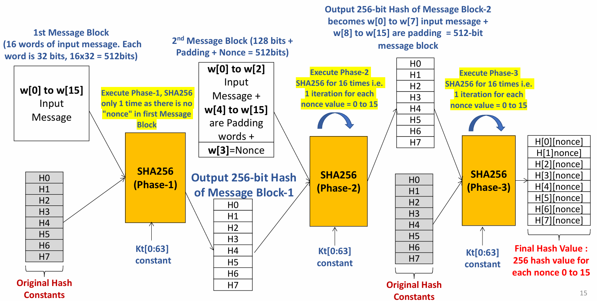

## Overview
This project implements a Bitcoin Hash model in SystemVerilog built around the, slightly modified, `simplified_sha256.sv` module. 
[My SHA-256 hardware module](https://github.com/bigbyrus/SHA-256) was modified so that it only concerns itself with processing 512-bit blocks, and writing the output hash to the top module, `bitcoin_hash.sv`.
The design is structured to mimic **Bitcoin's mining process where a 640-bit block header is hashed repeatedly, trying different nonce values**. The specific project flow is as follows: 

  

---

### First Iteration

    +--------------------------------------------------+
    ; Slow 900mV 100C Model Fmax Summary               ;
    +------------+-----------------+------------+------+
    ; Fmax       ; Restricted Fmax ; Clock Name ; Note ;
    +------------+-----------------+------------+------+
    ; 116.59 MHz ; 116.59 MHz      ; clk        ;      ;
    +------------+-----------------+------------+------+

    Logic utilization : 95 %
        Combinational ALUTs : 18,956 / 36,100 ( 53 % )
        Memory ALUTs : 0 / 18,050 ( 0 % )
        Dedicated logic registers : 27,762 / 36,100 ( 77 % )
    Total registers : 27762

    Cycles: 348
    Delay: 2.98 (microseconds)
    Delay * Area: 139.44 (ms*Area)
    
---

### Reduced SHA-256 Logic, Second Iteration

    +--------------------------------------------------+
    ; Slow 900mV 100C Model Fmax Summary               ;
    +------------+-----------------+------------+------+
    ; Fmax       ; Restricted Fmax ; Clock Name ; Note ;
    +------------+-----------------+------------+------+
    ; 122.26 MHz ; 122.26 MHz      ; clk        ;      ;
    +------------+-----------------+------------+------+

    Logic utilization : 95 %
        Combinational ALUTs : 18,923 / 36,100 ( 52 % )
        Memory ALUTs : 0 / 18,050 ( 0 % )
        Dedicated logic registers : 27,744 / 36,100 ( 77 % )<
    Total registers : 27744

    Cycles: 342
    Delay: 2.79 (microseconds)
    Delay * Area: 130.54 (ms*Area)

---

### Pipelined Version, Fifth Iteration

    +--------------------------------------------------+
    ; Slow 900mV 100C Model Fmax Summary               ;
    +------------+-----------------+------------+------+
    ; Fmax       ; Restricted Fmax ; Clock Name ; Note ;
    +------------+-----------------+------------+------+
    ; 187.2 MHz  ; 187.2 MHz       ; clk        ;      ;
    +------------+-----------------+------------+------+

    Cycles: 486
    Delay: 2.59 (microseconds)
    Delay * Area: 119.79 (ms*Area)

    Logic utilization : 98 %
        Combinational ALUTs : 12,488 / 36,100 ( 34 % )
        Memory ALUTs : 0 / 18,050 ( 0 % )
        Dedicated logic registers : 33,762 / 36,100 ( 94 % )
    Total registers : 33762

Since I am optimizing for Area and Speed, this pipelined version falls short in terms of efficiency.
Splitting up the critical path increased Fmax substantially, but the increase in cycles and registers shows that a larger Fmax
does not directly contribute to a more efficient design.

---

### Last Iteration

    +--------------------------------------------------+
    ; Slow 900mV 100C Model Fmax Summary               ;
    +------------+-----------------+------------+------+
    ; Fmax       ; Restricted Fmax ; Clock Name ; Note ;
    +------------+-----------------+------------+------+
    ; 136.86 MHz ; 136.86 MHz      ; clk        ;      ;
    +------------+-----------------+------------+------+

    Cycles: 294
    Delay: 2.14 microseconds
    Delay * Area: 84.98 (ms*Area)

    Logic utilization : 93 %
    Combinational ALUTs : 12,481 / 36,100 ( 35 % )
    Memory ALUTs : 0 / 18,050 ( 0 % )
    Dedicated logic registers : 27,232 / 36,100 ( 75 % )
    Total registers : 27232